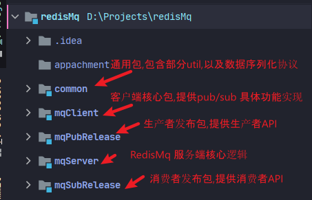

# redisMq

一个基于Redis与Netty开发的具有ACK机制的,支持Fifo/Priority 机制的消息队列。

+ bg:
  + 在部分应用项目中,可能处于解耦或是异步化考虑,会引入消息队列用以分离生产者与消费者,市面上已有成熟的**kafka**,**RabbitMq**等高可用的消息队列实现.但是都需要安装对应的Mq服务,考虑到redis的普及性,以及出于对网络编程的学习,故开发此项目。
+ redisMq:一个基于Netty网络通信,Redis(5.0及以上),的简单消息队列实现,拥有如下特点.
  + **不错的网络性能**: 
    + 基于**Netty4.1.56final** 进行网络异步通信,提供了海量并发能力。
  + **基于REDIS**: 
    + redis提供的高效缓存能力,以及RDB/AOF持久化解决方案,使得可通过配置,得到性能与数据不丢失的权衡.
  + **FIFO模型**: 
    + 基于redis 的lists数据结构,可实现Mq数据的fifo实现,此模式性能最高.相对时间复杂度最低.
  + **Priority模型**:
    + 基于redis 的Sorted Set数据结构,实现了带权消息的优先级排列,可通过发布数据指定权值,决定消费优先级.
  + **可信任的ACK机制**:
    + 所有的消息发布都提供了两种ACK机制,自动与手动,自动ACK机制下,当消息成功发布到客户端,即认为成功消费,丢弃消息,手动消费,则需要调用端手动确认.反之,服务端没有接收到ACK确认,则会重新发布该消息。
  + **友好的发布/消费方式**:
    + 生产者:提供生产者发布消息API:**Publisher**
    + 消费者:提供客户端主动调用API:**PassiveCaller**,客户端自动监听消费注解:**@MqSubScribe**


+ 系统架构:
  + 


### 使用示例:

+ 编译:

  + 根据 common->mqServer->mqClient->mqPubRelease->mqSubRelease 的顺序,依次于各模块包之下编译安装

    + ```shell
      mvn clean install
      ```

+ 服务端部署:

  + 直接启动服务

    + ```shell
      java -jar mqServer-***.jar
      ```

  + 注册到现有项目中(需要maven  设置 优先从本地获取jar包),通过配置项启动:

    + ```xml
              <dependency>
                  <groupId>com.zakl</groupId>
                  <artifactId>mqServer</artifactId>
                  <version>1.0-SNAPSHOT</version>
              </dependency>
      ```

    + 添加配置项(此处为SpringBoot 中配置注册)

      ```java
      @Configuration
      public class Config {
          static {
              InitServerService.init();
          }
      }
      ```

    + 非Spring项目中请调用:

      ```java
      InitServerService.init();
      ```
      
    + 配置文件说明:

         ```properties
         server.mqPubPort=5000
         
         ```

  server.mqSubPort=6000
         
         #MqServer memory buf size,
         # if 0,mean pubMsg will be direct deliver to redisServer,not buffer in MqServer' memory,(less performance ,better consistency)
         # suggested value 10000,depends on your server memory
         server.MqSubMsgBufSize=5
         
         # RedisConfig
         
         redis.host=172.25.189.166
         
         redis.port=6379
         
         redis.pwd=
         
         redis.db=7
         ```

+ 生产者/消费者:

  + 注册到现有项目中(需要maven  设置 优先从本地获取jar包),通过配置项启动:

    + ```xml
      <!--生产者-->
      <dependency>
          <groupId>com.zakl</groupId>
          <artifactId>mqPubRelease</artifactId>
          <version>1.0-SNAPSHOT</version>
      </dependency>
      
      <!--消费者-->
      <dependency>
          <groupId>com.zakl</groupId>
       	<artifactId>mqSubRelease</artifactId>
          <version>1.0-SNAPSHOT</version>
      </dependency>
      ```

  + 添加配置项(此处为SpringBoot 中配置注册)

    ```java
    @Configuration
    public class Config {
        static {
            InitClientService.init();
        }
    }
    ```

  + 非Spring项目中请主动调用:

    ```java
    InitClientService.init();
    ```

  + 配置文件:

    ```properties
    #MqServer ip地址
    server.ip=127.0.0.1
    #Mq生产者端口
    server.mqPubPort=5000
    #Mq消费者端口
    server.mqSubPort=6000
    
    # 消费端自动消费(使用MqSubscribe) 方法所在包名
    client.consumerPackage=com.zakl.consume
    ```

+ 代码示例:

  + 生产者:

    + 像K1,k2队列发送具有优先级的消息数据.
    
      ```java
        public static void main(String[] args) {
      
              Random random = new Random();
      
              new Thread(new Runnable() {
                  @SneakyThrows
                  @Override
                  public void run() {
                      Thread.sleep(5000);
                      while (true) {
                          Thread.sleep(1000);
                          String[] keys = {"k1","k2"};
                          for (String key : keys) {
                              String value = "HelloWorld" + DateUtil.format(new Date(),"yyyy/MM/dd HH:mm:ss");
                              Publisher.publishToSortedSetKey(key, new Pair<>(random.nextDouble() * 100, value));
                          }
                      }
                  }
              }).start();
              new MqClientContainer(true).start();
      
          }
      ```
    
  + 消费者:

    + 注解消费模式:

      + 自动ACK确认:

        ```java
        public class Consumer extends TemplateConsumer {
            @Override
            @MqSubScribe(keys = "k1")
            public void consumeWithAutoAck(List<MqMessage> msgs) {
                for (MqMessage msg : msgs) {
                    System.out.println(msg);
                }
            }
        }
        ```

      + 手动ACK确认:

        ```java
            @Override
            @MqSubScribe(keys = "k2")
            public void consumeWithManualAck(List<MqMessage> msgs, AckClientHandler ackHandler) {
                for (MqMessage msg : msgs) {
                    System.out.println(msg);
                }
                ackHandler.confirm(msgs.toArray(new MqMessage[0]));
                super.consumeWithManualAck(msgs, ackHandler);
            }
        ```

    + 主动调用消费模式:

      ```java
          public void consume(String key, int cnt) {
              List<MqMessage> messages = PassiveCaller.doConsume(true, new Pair<>(key, cnt));
              for (MqMessage message : messages) {
                  System.out.println(message);
              }
          }
      ```


## other


### todo

1. Server端的服务注册
2. Server端Docker容器部署


